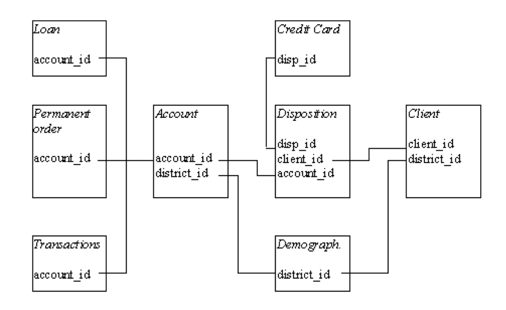

# Exploratory Analysis Project

This project is part of the Exploratory Data Analysis discipline of the Getulio Vargas Foundation in Business Analytics and Big Data MBA. Members of the group: Matheus Amaral Mões, Marcelo Semerene Farah, Luísa Belus Henriques and Daniela de Góes N. Georg

Context and objective The manager of a Czech bank wants to get a better understanding on his clients. To do so, it has an extensive database that records customers and their transactions as follows:

To assist the manager, our team works with the database in the following steps: Understand, clean and organize data; Search relationships between data; Find product and service opportunities for the bank.

To assist the manager, our team worked with the database in the following steps: 1. Understand, clean and organize data; 2. Search relationships between data; 3. Find product and service opportunities for the bank.

This book is organized according to the steps taken to reach a conclusion about the clients:
https://moesmatheus.github.io/exploratory_analysis/

